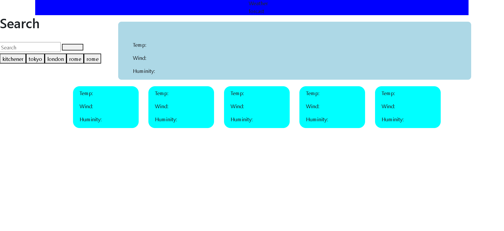
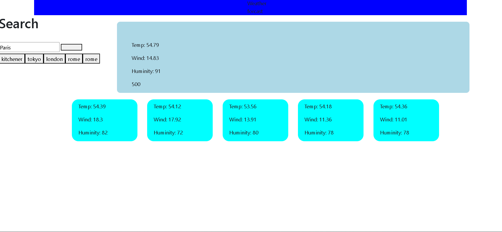
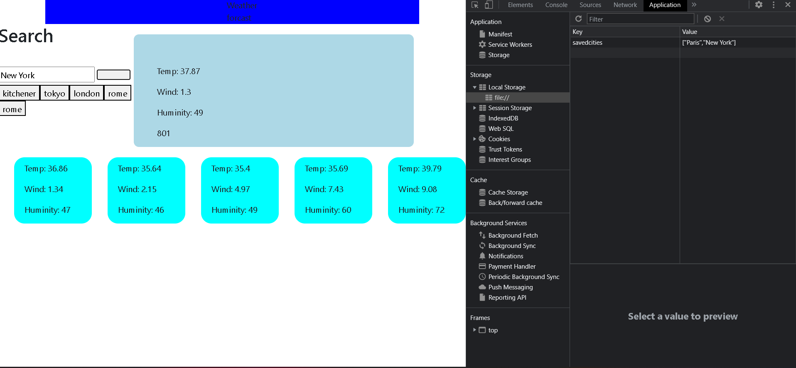

# Weather-Forcast

# <Weather-Forcast>

## Description

Provide a short description explaining the what, why, and how of your project. Use the following questions as a guide:

- What was your motivation?
using an weather api to forcast the weather for any city in the weather by showcasting the wind sheild, tempeture and huminity

- Why did you build this project? (Note: the answer is not "Because it was a homework assignment.")
i build this project to showcase the weather for any city thats inset in the search button
- What problem does it solve?
this appliation solves the knowing of what weather it is in any city
- What did you learn?
i learned how to collect an api and multipate the direction and make it my own by using the data.

## Table of Contents (Optional)

If your README is long, add a table of contents to make it easy for users to find what they need.

- [Installation](#installation)
- [Usage](#usage)
- [Credits](#credits)
- [License](#license)

## Installation

What are the steps required to install your project? Provide a step-by-step description of how to get the development environment running.

first i create a containers with an id that will display the 5 days weather as well as the current weather forcast.
i then call out for the weather api using fetch that contains the data 
i then edit the api link to also add the lonatitude and lantitude to determine the city thats search up.
then forth i ftech call the api once again to add it within the saved city along the side of the page.
while calling the api i console,log the data within the 5 days container as well as the current day.

## Usage

Provide instructions and examples for use. Include screenshots as needed.

    
    

## Credits

## License
 [https://choosealicense.com/](https://choosealicense.com/).

 MIT License

Copyright (c) [ye] [Abel Alemu]

Permission is hereby granted, free of charge, to any person obtaining a copy
of this software and associated documentation files (the "Software"), to deal
in the Software without restriction, including without limitation the rights
to use, copy, modify, merge, publish, distribute, sublicense, and/or sell
copies of the Software, and to permit persons to whom the Software is
furnished to do so, subject to the following conditions:

The above copyright notice and this permission notice shall be included in all
copies or substantial portions of the Software.

THE SOFTWARE IS PROVIDED "AS IS", WITHOUT WARRANTY OF ANY KIND, EXPRESS OR
IMPLIED, INCLUDING BUT NOT LIMITED TO THE WARRANTIES OF MERCHANTABILITY,
FITNESS FOR A PARTICULAR PURPOSE AND NONINFRINGEMENT. IN NO EVENT SHALL THE
AUTHORS OR COPYRIGHT HOLDERS BE LIABLE FOR ANY CLAIM, DAMAGES OR OTHER
LIABILITY, WHETHER IN AN ACTION OF CONTRACT, TORT OR OTHERWISE, ARISING FROM,
OUT OF OR IN CONNECTION WITH THE SOFTWARE OR THE USE OR OTHER DEALINGS IN THE
SOFTWARE.

---

🏆 The previous sections are the bare minimum, and your project will ultimately determine the content of this document. You might also want to consider adding the following sections.

## Badges

Badges aren't necessary, per se, but they demonstrate street cred. Badges let other developers know that you know what you're doing. Check out the badges hosted by [shields.io](https://shields.io/). You may not understand what they all represent now, but you will in time.

## Features

If your project has a lot of features, list them here.

## How to Contribute

If you created an application or package and would like other developers to contribute it, you can include guidelines for how to do so. The [Contributor Covenant](https://www.contributor-covenant.org/) is an industry standard, but you can always write your own if you'd prefer.

## Tests

Go the extra mile and write tests for your application. Then provide examples on how to run them here.